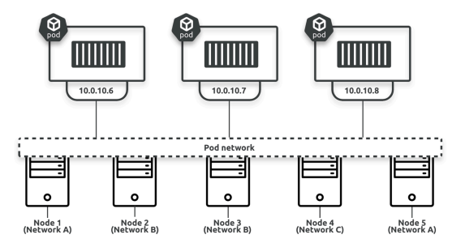

# Pod theory
The atomic unit of scheduling in Kubernetes is the Pod.

## Why pods
There are three main reasons for Pods:
1. Pods augment containers
2. Pods assist in scheduling
3. Pods enable resource sharing  

### Pods augment containers
Pods augment containers in all the following ways:
1. Labels and annotations
2. Restart policies
3. Probes (startup probes, readiness probes, liveness probes, and potentially more)
4. Affinity and anti-affinity rules
5. Termination control
6. Security policies
7. Resource requests and limits  
  
Run a `kubectl explain pods` command to list all possible Pod attributes.  
  
#### Some of the pod features are:
- Labels let you group Pods and associate them with other objects in powerful ways.
- Annotations let you add experimental features and integrations with 3rd-party tools and services.
- Probes let you test the health and status of Pods and the apps they run.
> This enables advanced scheduling, updates, and more.
- Affinity and anti-affinity rules give you control over where in a cluster Pods are allowed to run.
- Termination control lets you gracefully terminate Pods and the applications they run.
- Security policies let you enforce security features.
- Resource requests and limits let you specify minimum and maximum values for things like CPU, memory, and disk IO.  

### Pods assist in scheduling
Labels, affinity and anti-affinity rules, as well as resource requests and limits give you fine-grained control over which worker nodes Pods can run on.  

### Pods enable resource sharing
On the sharing of resources front, Pods provide a shared execution environment for one or more containers.  
  
#### This shared execution environment includes things such as:
- Shared filesystem
- Shared network stack (IP address, routing table, ports…)
- Shared memory
- Shared volumes
> This means that if a Pod has two containers, both will share the Pod’s IP address and can access any of the Pod’s volumes to share data.  

### Static Pods vs controllers
#### There are two ways to deploy Pods:
1. Directly via a Pod manifest  
Pods deployed directly from a Pod manifest are called static Pods and have no superpowers such as self-healing, scaling, or rolling updates.  
> **This is because they’re only monitored and managed by the worker node’s kubelet process which is limited to attempting restarts on the local worker node.**  
**If the worker node they’re running on fails, there’s no control-plane process watching and capable of starting a new one on a different node.**

2. Indirectly via a controller  
Pods deployed via controllers have all the benefits of being monitored and managed by a highly-available controller running on the control-plane.
> The local kubelet can still attempt local restarts, but if restart attempts fail, or the node itself fails, the observing controller can start a replacement Pod on a different worker node.  

### Deploying Pods
The process of deploying a Pod to Kubernetes is as follows:
1. Define it in a YAML manifest file
2. Post the YAML to the API server
3. The API server authenticates and authorizes the request
4. The configuration (YAML) is validated
5. The scheduler deploys the Pod to a healthy worker node with enough available resources
6. The local kubelet monitors it  
> If the Pod is deployed via a controller, the configuration will be added to the cluster store as part of overall desired state and a controller will monitor it.  

### The anatomy of a Pod
At the highest level, a Pod is an execution environment shared by one or more containers:
- net namespace: IP address, port range, routing table…
- pid namespace: isolated process tree
- mnt namespace: filesystems and volumes…
- UTS namespace: Hostname
- IPC namespace: Unix domain sockets and shared memory  

### Pods and shared networking
Every Pod has its own network namespace.  
This means every Pod has its own IP address, its own range of TCP and UDP ports, and its own routing table.
> In multi-container pods Container-to-container communication within the same Pod happens via the Pod’s localhost adapter and a port number. for example localhost:5000 or localhost:80  

### The pod network
On the topic of networking, every Pod gets its own unique IP address that’s fully routable on an internal Kubernetes network called the pod network.  
This is a flat overlay network that allows every Pod to talk directly to every other Pod even if the worker nodes are all on different underlay networks.  
  
> In a default out-of-the-box cluster, the pod network is wide open from a security perspective. You should use Kubernetes Network Policies to lock down access.  

### Atomic deployment of Pods
Pod deployment is an atomic operation. This means deployment either succeeds or it fails.  
You’ll never have a scenario where a partially deployed Pod is servicing requests. Only after all a Pod’s containers and resources are running and ready will it start servicing requests.  

### Pods lifecycle
#### Shorted-lived pods
- Pods that are designed to run a specific job and then terminates. such as batch jobs, are designed to be short-lived and only run
until a task completes.
- Once all containers in a short-lived Pod successfully terminate, the Pod terminates and its status is set to successful.  
> Appropriate container restart policies for short-lived Pods will usually be **Never or OnFailure**.

#### Long-lived Pods
- Pods that have containers that needs to be up and running always like a web server.
- If any container in a long-lived Pod fail, the local kubelet may attempt to restart them based on the container’s restart policy.
> Appropriate container restart policies are **Always, OnFailure, and Never**. Always is the default restart policy and appropriate for most long-lived Pods.  

#### Kubernetes has several controllers for different types of long-lived and short-lived workloads.
- Deployments, StatefulSets, and DaemonSets are examples of controllers designed for long-lived Pods.
- Jobs and CronJobs are examples designed for short-lived Pods.

### Pod immutability
Pods are immutable objects. This means you can’t modify them after they’re deployed.  

### Pods and scaling
If you need to scale the app, you add or remove Pods.  
You never scale an app by adding more of the same application containers to an existing Pod.  
**Multi-container Pods** are only for co-scheduling and co-locating containers that need tight coupling, they’re not a way to scale an app.  
